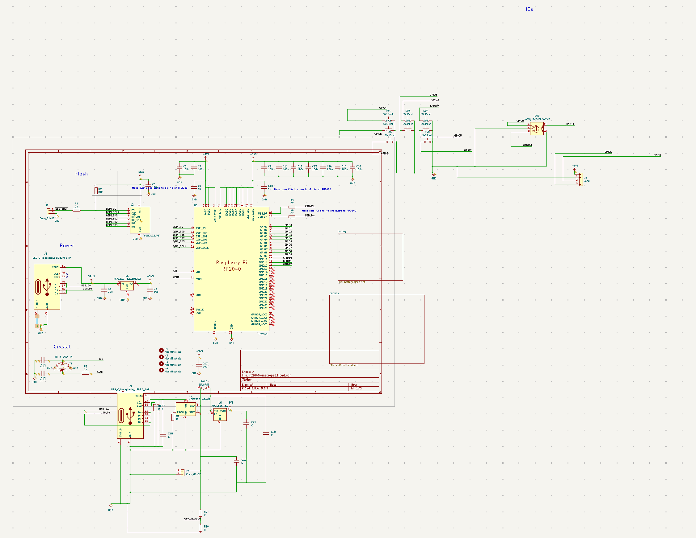
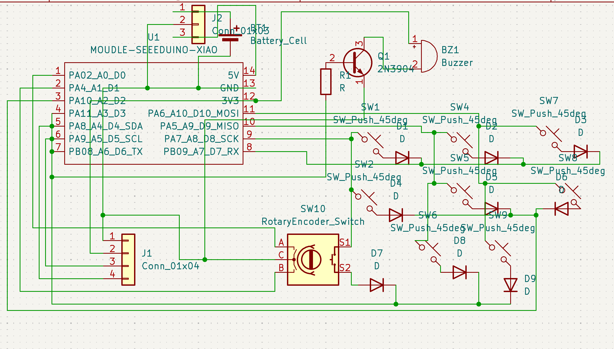
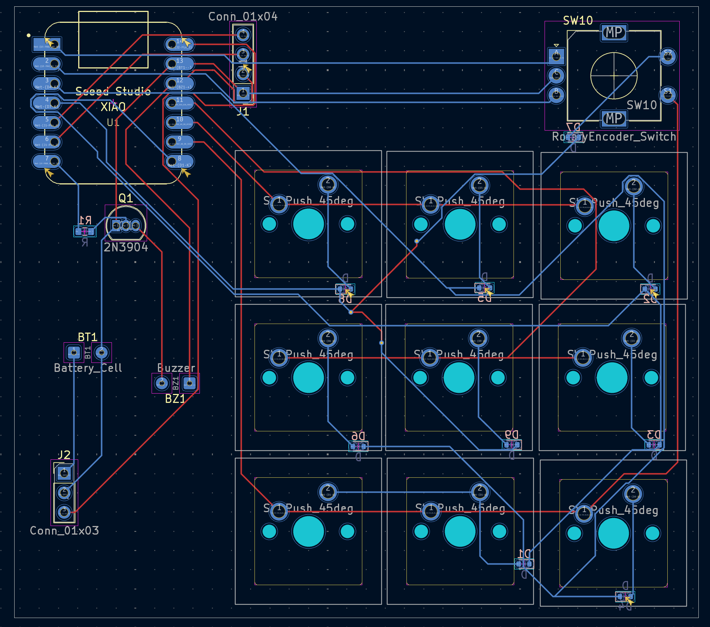

# July 4: Starting the Design

Fed AI the details of my project and asked for parts and shematics to use. Imported the rp2040 Minimal design example from the official pdf as an 
introduction face as this is my first time using a direct rp2040 chip outside a dev board. I determined the idea and logic behind how i wanted to 
develop the device added it to AI and used it to develop the basic idea for the project.

**Total time spent: 93 Minutes**

# Jul 10: Changed the Design

decided to change from using a raw rp2040 to using the Seeed Studio XIAO RP2040 as i already had one and it would allow for the cost of the final product to be lower. Due to lower gpio pins available I changed to a keyboard matrix for the 8 keys and rotary encoder. changed from a lipo battery to 3 rechargable AA as it would be easier to design. 

**Total time spent: 94 Minutes**

# Jul 16: designed pcb

in order to start designing the pcb i needed to find some components on aliexpress in order to use the correct footprint. As i has designing the pcb my idea was to have one button with 2u in width as a main pause/resume/start/etc button used for the main functionality but that would require stabalizers that i didn't want to buy. to get round this i modified the schematic to use 2 push switches with the exact same gpio input and output pins so i could simply connect one keycap to both of them which would be more cost effective. I attempted to make the device as small as i could while maintaining my idea for how it would look. for simplicity in routing i regularly switched between front and back traces and made the matrix switches as close to the schematic as i felt needed. Overall the design is fairly small however it may be modified if new ideas come to mind.

**Total time spent: 89 Minutes**

